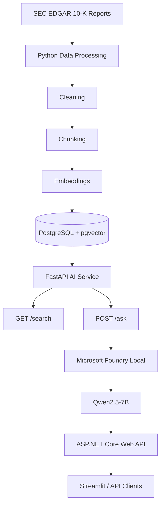

# NASDAQ Financial RAG Assistant

**English** | [Türkçe](README.md)

[](https://github.com/hmertelitok/nasdaq-financial-rag/actions)
[](https://www.python.org/)
[](https://dotnet.microsoft.com/)
[](LICENSE)
[](https://github.com/hmertelitok/nasdaq-financial-rag/releases)
[](https://github.com/hmertelitok/nasdaq-financial-rag/stargazers)

**NASDAQ Financial RAG Assistant** is a Turkish-language financial research assistant that operates over the SEC 10-K filings of selected NASDAQ companies. It was developed as part of the Microsoft AI Innovators Summer Internship program.

Given a user question, the system retrieves the relevant report fragments through PostgreSQL and pgvector, generates a source-grounded answer using a local language model running on Microsoft Foundry Local, and surfaces the filing, section, chunk, and similarity scores that each answer is based on.

> **Note:** This project does not provide investment advice. It is built for researching, summarizing, and performing source-grounded analysis of SEC filings.

---

## Table of Contents

- [Project Introduction Video](#project-introduction-video)
- [Quick Start](#quick-start)
- [Application Screenshots](#application-screenshots)
- [Project Purpose](#project-purpose)
- [Supported Companies](#supported-companies)
- [Data Source](#data-source)
- [Key Features](#key-features)
- [Technologies Used](#technologies-used)
- [System Architecture](#system-architecture)
- [Service Responsibilities](#service-responsibilities)
- [RAG Answer Quality System](#rag-answer-quality-system)
- [Quality Evaluation Results](#quality-evaluation-results)
- [Example Questions](#example-questions)
- [Project Status](#project-status)
- [Installation and Running](#installation-and-running)
- [API Documentation](#api-documentation)
- [Contributing](#contributing)
- [License](#license)
- [Contact](#contact)
- [Acknowledgments](#acknowledgments)
- [Legal Disclaimer](#legal-disclaimer)

---

## Project Introduction Video

This project was developed as part of the Microsoft AI Innovators Summer Internship program. The video below summarizes the development process, the technologies used, and the learning journey in three minutes.

<div align="center">
  <a href="https://youtu.be/mT0T21iGME4" target="_blank">
    
  </a>
  <br>
  <sub><i>Click the image above to watch the video.</i></sub>
</div>

**Video Contents:**
- The development process and architectural decisions
- Technologies used (ASP.NET Core, FastAPI, PostgreSQL + pgvector, Microsoft Foundry Local)
- The RAG (Retrieval-Augmented Generation) architecture and implementation details
- Technical skills gained during the internship

---

## Quick Start

Two installation methods are provided for users.

### Method 1: Pre-built Releases (Recommended)

To run the system without dealing with build and setup steps, you can use the ready-made packages published on GitHub Releases.

**1. Download the Packages**

From the [Releases](https://github.com/hmertelitok/nasdaq-financial-rag/releases) page, download the following archives for the latest version:
- `Nasdaq-Dotnet-API.zip`
- `Nasdaq-Python-App.zip`

**2. Extract the Archives**

Extract both archives into separate directories.

**3. Start the Services**

*Start the .NET API service first:*
1. Navigate to the `Nasdaq-Dotnet-API` directory.
2. Run the `baslat.bat` file.
3. Wait for confirmation in the console window that the API has started successfully.

*Then start the Python services:*
1. Navigate to the `Nasdaq-Python-App` directory.
2. Run the `baslat.bat` file.
3. The system will create the required Python environment, install dependencies, and start the FastAPI and Streamlit services.

**4. Access the Interface**

- **Streamlit Dashboard:** http://localhost:8501
- **FastAPI API Docs:** http://127.0.0.1:8001/docs

**Requirements:**
- Windows 10/11 (required for WinML support)
- Docker Desktop (must be running in the background for the PostgreSQL service)

**Stopping the Services:**

Close all open console windows and run the following command in the Python application directory:
```bash
docker-compose down
```

### Method 2: Installation from Source (For Developers)

After cloning the project, you can prepare the development environment using the automated setup script:

**Windows:**
```cmd
.\setup-and-run.bat
```

**Mac / Linux:**
```bash
chmod +x setup-and-run.sh
./setup-and-run.sh
```

The script will create the Docker volume, prepare the environment variables, install dependencies, and start all services.

---

## Application Screenshots

### Streamlit Interface

A control panel that brings together ASP.NET Core, FastAPI, PostgreSQL + pgvector, and Microsoft Foundry Local components within a single research interface.


### Source-Grounded RAG Answer

User questions are answered with source references, using the selected SEC 10-K report fragments.


### Source Transparency

For every answer, the company, filing date, section, chunk ID, similarity score, retrieval type, and embedding model are displayed.


<details>
<summary>View the original SEC 10-K source</summary>

<br>


</details>

---

## Project Purpose

SEC 10-K filings are lengthy, technical financial documents that are time-consuming to review manually.

Rather than building a general-purpose chatbot, the goal of this project is to create a financial RAG system that:

- Operates over real SEC documents
- Supports its answers with source fragments
- Can use a local model and local data infrastructure
- Combines Python and ASP.NET Core services
- Validates answer quality through automated checks
- Displays source transparency in the user interface

---

## Supported Companies

| Ticker | Company |
|---------|---------|
| AAPL | Apple Inc. |
| MSFT | Microsoft Corporation |
| NVDA | NVIDIA Corporation |
| AMZN | Amazon.com, Inc. |
| GOOGL | Alphabet Inc. |

---

## Data Source

The project uses 10-K filings retrieved from SEC EDGAR.

The current dataset contains:

- 5 companies
- 5 SEC filings
- 334 document chunks

---

## Key Features

- Downloading and processing SEC 10-K filings
- Financial document cleaning and chunking
- Multilingual embedding generation
- Vector storage on PostgreSQL and pgvector
- Retrieving relevant document fragments via Semantic Search
- Local answer generation with Microsoft Foundry Local
- Turkish, source-grounded RAG answers
- Source citations in the `[Source N]` format
- Display of filing type, section, chunk, and similarity score
- FastAPI-based internal AI service
- ASP.NET Core Web API
- Analysis for a single company or all companies
- Dynamic example questions
- API error handling
- Loading status and analysis progress indicators
- Automated RAG answer quality evaluation
- JSON and CSV quality reports
- Modern Streamlit interface

---

## Technologies Used

### AI and Data Processing

- Python
- Microsoft Foundry Local
- Qwen2.5-7B
- `intfloat/multilingual-e5-small`
- Retrieval-Augmented Generation (RAG)
- Semantic Search
- Embeddings

### Backend

- FastAPI
- ASP.NET Core Web API
- C#

### Data Layer

- PostgreSQL
- pgvector
- SEC EDGAR

### Interface

- Streamlit

---

## System Architecture



---

## Service Responsibilities

### Python

- SEC data processing
- Text cleaning
- Chunking
- Embedding generation
- pgvector semantic search
- Foundry Local integration
- RAG answer generation
- Quality evaluation

### FastAPI

The internal AI service used by ASP.NET Core.

| Method | Endpoint | Description |
|---------|----------|----------|
| GET | /health | Health check |
| GET | /search | Semantic Search |
| POST | /ask | Source-grounded RAG answer |

### ASP.NET Core Web API

The external API layer of the system.

| Method | Endpoint | Description |
|---------|----------|----------|
| GET | /api/health | API health check |
| GET | /api/postgres/companies | Companies |
| GET | /api/postgres/stats/summary | Data summary |
| GET | /api/postgres/filings | Filing records |
| GET | /api/postgres/chunks | Chunk list |
| GET | /api/postgres/search | Semantic Search |
| POST | /api/rag/ask | RAG answer |

---

## RAG Answer Quality System

The project validates not only whether the HTTP response is successful, but also the content quality of the generated answer, automatically.

Checks:

- HTTP 200 status
- Answer presence
- At least three sources
- Expected number of items
- Source citation in each item
- Citation range validation
- `[Source N]` format
- Corrupted source display check
- Merged word errors
- Item length
- Investment advice warning
- Low-quality expressions
- Repeated items
- Turkish language check
- Reasonable answer length

---

## Quality Evaluation Results

In the automated quality tests conducted on July 14, 2026, the system produced successful results for all companies.

| Ticker | Result | HTTP | Sources | Items | Citations |
|---------|------|------|---------|-------|------|
| AAPL | PASS | 200 | 5 | 4 | 4 |
| MSFT | PASS | 200 | 5 | 4 | 4 |
| NVDA | PASS | 200 | 5 | 4 | 4 |
| AMZN | PASS | 200 | 5 | 4 | 4 |
| GOOGL | PASS | 200 | 5 | 4 | 4 |

```text
Total        : 5
Successful   : 5
Failed       : 0
Success Rate : 100%
```

Reports:

```text
reports/rag-quality/rag_quality_evaluation.json
reports/rag-quality/rag_quality_evaluation.csv
```

Run:

```powershell
& ".\.venv\Scripts\python.exe" .\src\evaluate_rag_answer_quality.py `
    --output-dir .\reports\rag-quality
```

---

## Example Questions

```text
How do Microsoft's cloud computing and artificial intelligence investments support the company's growth strategy?
```

```text
What are NVIDIA's risks related to its supply chain, export controls, and AI demand?
```

```text
What are Apple's key business risks?
```

```text
What are Amazon's risks regarding AWS, logistics, operational costs, and regulation?
```

---

## Project Status

Completed components:

- SEC data processing pipeline
- Text cleaning
- Chunking
- Embedding
- PostgreSQL
- pgvector
- Semantic Search
- FastAPI
- Microsoft Foundry Local
- ASP.NET Core Web API
- Source-grounded RAG
- Quality evaluation system
- JSON/CSV reports
- Streamlit interface
- End-to-end tests
- Installation documentation
- Automated CI/CD and distribution infrastructure

---

## Installation and Running

> **Docker Note:** `docker-compose.yml` runs only the PostgreSQL + pgvector service inside a container. Because Microsoft Foundry Local requires Windows/WinML hardware acceleration, FastAPI, ASP.NET Core, and Streamlit are run on the host machine.

Detailed installation:

```text
docs/setup_and_run.md
```

Service order:

```text
PostgreSQL + pgvector
          |
          v
FastAPI
          |
          v
ASP.NET Core
          |
          v
Streamlit
```

---

## API Documentation

```text
docs/postgres_pgvector_api.md
```

---

## Contributing

Contributions are welcome. Please follow the steps below:

1. Fork the project
2. Create a new branch (`git checkout -b feature/amazing-feature`)
3. Commit your changes (`git commit -m 'feat: add amazing feature'`)
4. Push your branch (`git push origin feature/amazing-feature`)
5. Open a Pull Request

---

## License

This project is licensed under the MIT License. See the [LICENSE](LICENSE) file for details.

---

## Contact

**Halis Mert Elitok**
- GitHub: [@hmertelitok](https://github.com/hmertelitok)
- LinkedIn: [linkedin.com/in/hmertelitok](https://linkedin.com/in/hmertelitok)
- Email: [your email address]

---

## Acknowledgments

- **Microsoft AI Innovators** - Internship program and mentorship support
- **SEC EDGAR** - Open data source
- **pgvector** - Vector search support for PostgreSQL
- **Microsoft Foundry Local** - Local model inference infrastructure

---

## Legal Disclaimer

This project does not provide investment advice.

The generated answers are prepared solely for the purpose of researching, summarizing, and providing document-based information from SEC 10-K filings. They should not be used on their own for financial decisions.
