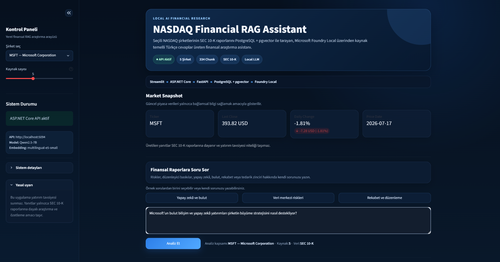
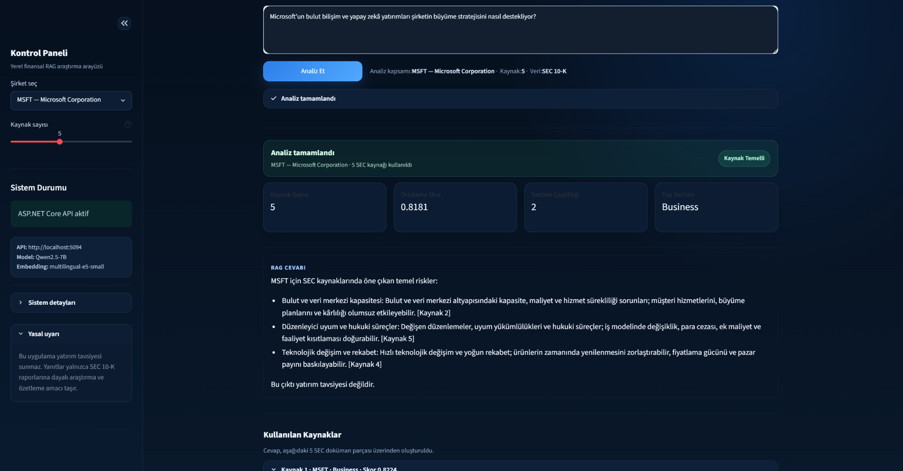
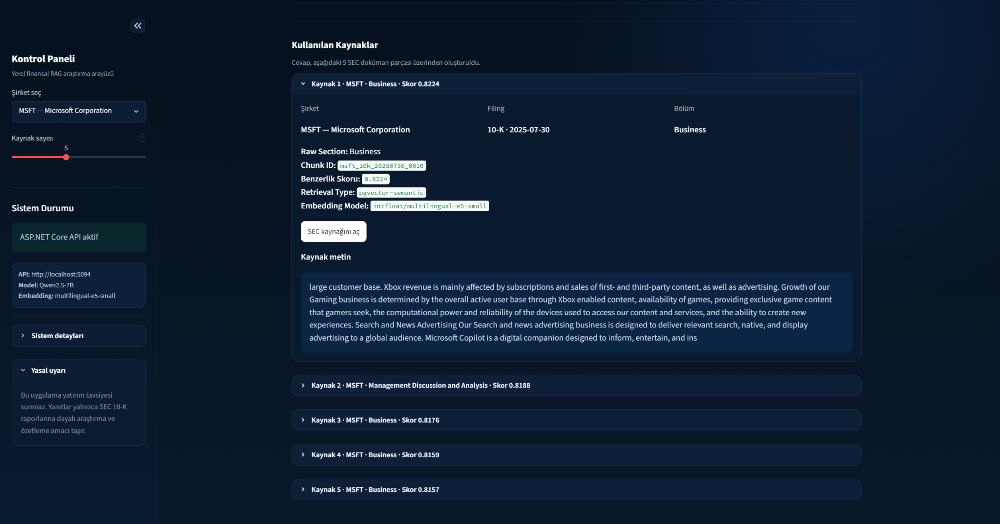
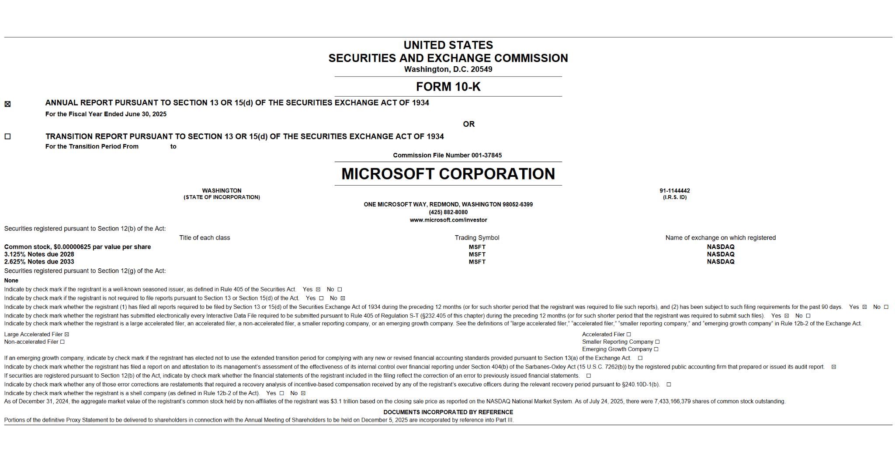

# NASDAQ Financial RAG Assistant

Microsoft AI Innovators Summer Internship programı kapsamında geliştirilen **NASDAQ Financial RAG Assistant**, seçili NASDAQ şirketlerinin SEC 10-K raporları üzerinde çalışan Türkçe bir finansal araştırma asistanıdır.

Sistem; kullanıcı sorusuyla ilgili rapor parçalarını PostgreSQL ve pgvector üzerinden getirir, Microsoft Foundry Local üzerinde çalışan yerel dil modeliyle kaynak temelli yanıt üretir ve cevabın dayandığı filing, section, chunk ve benzerlik skorlarını kullanıcıya gösterir.

> Bu proje yatırım tavsiyesi üretmez. SEC raporlarının araştırılması, özetlenmesi ve kaynak temelli analiz edilmesi amacıyla geliştirilmiştir.

## Uygulama Görselleri

### Streamlit Arayüzü

ASP.NET Core, FastAPI, PostgreSQL + pgvector ve Microsoft Foundry Local bileşenlerini tek bir araştırma arayüzünde birleştiren kontrol paneli.



### Kaynak Temelli RAG Cevabı

Kullanıcı soruları, seçilen SEC 10-K rapor parçaları kullanılarak kaynak referanslarıyla yanıtlanır.



### Kaynak Şeffaflığı

Her cevap için şirket, filing tarihi, bölüm, chunk ID, benzerlik skoru, retrieval türü ve embedding modeli görüntülenir.



<details>
<summary>Orijinal SEC 10-K kaynağını görüntüle</summary>

<br>



</details>

## Proje Amacı

SEC 10-K raporları uzun, teknik ve manuel olarak incelenmesi zaman alan finansal dokümanlardır.

Bu projenin amacı, genel amaçlı bir chatbot geliştirmek yerine:

- Gerçek SEC dokümanları üzerinde çalışan
- Yanıtlarını kaynak parçalarıyla destekleyen
- Yerel model ve yerel veri altyapısı kullanabilen
- Python ve ASP.NET Core servislerini birlikte kullanan
- Yanıt kalitesini otomatik kontrollerle denetleyen
- Kaynak şeffaflığını kullanıcı arayüzünde gösteren

bir finansal RAG sistemi oluşturmaktır.

## Desteklenen Şirketler

| Ticker | Şirket |
|---|---|
| AAPL | Apple Inc. |
| MSFT | Microsoft Corporation |
| NVDA | NVIDIA Corporation |
| AMZN | Amazon.com, Inc. |
| GOOGL | Alphabet Inc. |

## Veri Kaynağı

Projede SEC EDGAR üzerinden alınan 10-K raporları kullanılmaktadır.

Mevcut veri setinde:

- 5 şirket
- 5 SEC filing
- 334 doküman parçası

bulunmaktadır.

## Temel Özellikler

- SEC 10-K raporlarını indirme ve işleme
- Finansal doküman temizleme ve chunking
- Çok dilli embedding üretimi
- PostgreSQL ve pgvector üzerinde vektör saklama
- Semantic search ile ilgili doküman parçalarını getirme
- Microsoft Foundry Local ile yerel yanıt üretimi
- Türkçe ve kaynak temelli RAG cevapları
- Cevaplarda `[Kaynak N]` biçiminde atıf gösterimi
- Filing type, section, chunk ve benzerlik skoru bilgisi
- FastAPI tabanlı dahili AI servisi
- ASP.NET Core Web API üzerinden dış servis katmanı
- Tek şirket ve tüm şirketler için analiz
- Şirket bazlı dinamik örnek sorular
- Kullanıcı dostu API hata yönetimi
- Aşamalı analiz durumu ve yükleme geri bildirimi
- Otomatik RAG cevap kalite değerlendirmesi
- JSON ve CSV kalite raporları
- Modern Streamlit dark theme arayüzü

## Kullanılan Teknolojiler

### AI ve Veri İşleme

- Python
- Microsoft Foundry Local
- Qwen2.5-7B
- `intfloat/multilingual-e5-small`
- Retrieval-Augmented Generation
- Semantic Search
- Embeddings

### Backend

- FastAPI
- ASP.NET Core Web API
- C#

### Veri Katmanı

- PostgreSQL
- pgvector
- SEC EDGAR

### Arayüz

- Streamlit

## Orkestrasyon Framework Kararı

Mevcut RAG hattı belirli, kontrollü ve test edilebilir olduğu için Semantic Kernel veya Microsoft Agent Framework bu sürüme eklenmemiştir.

Bu kararla:

- Mevcut deterministik RAG mimarisi korunmuştur.
- Retrieval, cevap üretimi ve kalite kontrolü mevcut servis sınırlarında tutulmuştur.
- Gereksiz framework bağımlılığı ve bakım yükü önlenmiştir.
- Agent tabanlı orchestration yalnızca gerçek bir ürün ihtiyacı oluştuğunda yeniden değerlendirilmek üzere ertelenmiştir.

Ayrıntılı mimari karar belgesi:

[`docs/orchestration_framework_assessment.md`](docs/orchestration_framework_assessment.md)

## Güncel Sistem Mimarisi

```text
SEC EDGAR 10-K Raporları
          ↓
Python Veri İşleme Katmanı
Temizleme → Chunking → Embedding
          ↓
PostgreSQL + pgvector
          ↓
FastAPI Dahili AI Servisi
/search → /ask
          ↓
Microsoft Foundry Local
Qwen2.5-7B
          ↓
ASP.NET Core Web API
          ↓
Streamlit / API İstemcileri
```

## Servis Sorumlulukları

### Python

- SEC dokümanlarını işleme
- Metin temizleme ve chunking
- Embedding üretme
- pgvector semantic search
- Foundry Local model entegrasyonu
- RAG cevap üretme
- Cevap kalite kontrolleri

### FastAPI

FastAPI, ASP.NET Core tarafından kullanılan dahili AI servisidir.

| Method | Endpoint | Açıklama |
|---|---|---|
| GET | `/health` | Servis sağlık kontrolü |
| GET | `/search` | pgvector semantic search |
| POST | `/ask` | Kaynak temelli RAG cevabı |

### ASP.NET Core Web API

ASP.NET Core, sistemin dışarıya açılan temel API katmanıdır.

| Method | Endpoint | Açıklama |
|---|---|---|
| GET | `/api/health` | API sağlık kontrolü |
| GET | `/api/postgres/companies` | Şirket listesi |
| GET | `/api/postgres/stats/summary` | Veri özeti |
| GET | `/api/postgres/filings` | SEC filing kayıtları |
| GET | `/api/postgres/chunks` | Doküman parçaları |
| GET | `/api/postgres/search` | Semantic search |
| POST | `/api/rag/ask` | RAG cevap üretimi |

## RAG Cevap Kalite Sistemi

Projede, üretilen cevapların yalnızca HTTP seviyesinde çalışması değil, içerik kalitesi açısından da denetlenmesi için otomatik değerlendirme sistemi bulunmaktadır.

Her cevap aşağıdaki kontrollerden geçirilir:

- HTTP 200 yanıtı
- Cevap varlığı
- En az üç kaynak
- Beklenen madde sayısı
- Her maddede kaynak atfı
- Atıfların kaynak aralığında bulunması
- Tam `[Kaynak N]` biçimi
- Bozulmuş veya aralıklı kısaltma bulunmaması
- Birleşmiş kelime hatası bulunmaması
- Maddelerin kısa ve anlaşılır olması
- Yatırım tavsiyesi uyarısı
- Düşük kaliteli ifadelerin bulunmaması
- Tekrarlanan maddelerin bulunmaması
- Türkçe dil kontrolü
- Makul cevap uzunluğu

## Kalite Değerlendirme Sonucu

14 Temmuz 2026 tarihinde beş şirket için gerçekleştirilen otomatik test sonucu:

| Ticker | Sonuç | HTTP | Kaynak | Madde | Atıf |
|---|---:|---:|---:|---:|---:|
| AAPL | PASS | 200 | 5 | 4 | 4 |
| MSFT | PASS | 200 | 5 | 4 | 4 |
| NVDA | PASS | 200 | 5 | 4 | 4 |
| AMZN | PASS | 200 | 5 | 4 | 4 |
| GOOGL | PASS | 200 | 5 | 4 | 4 |

```text
Toplam: 5
Başarılı: 5
Başarısız: 0
Başarı oranı: %100
```

Bu test koşusunda kalite kapısı, beş şirket için kontrollü ve kaynak temelli fallback cevaplarını kullanmıştır. Ham model çıktısı kalite kriterlerini karşılamadığında doğrulanabilir kaynaklara dayanan daha kararlı bir cevap üretilmektedir.

Test çıktıları:

- `reports/rag-quality/rag_quality_evaluation.json`
- `reports/rag-quality/rag_quality_evaluation.csv`

Değerlendirme komutu:

```powershell
& ".\.venv\Scripts\python.exe" .\src\evaluate_rag_answer_quality.py `
    --output-dir .\reports\rag-quality
```

## Örnek Sorular

```text
Microsoft'un bulut bilişim ve yapay zekâ yatırımları şirketin büyüme stratejisini nasıl destekliyor?
```

```text
NVIDIA'nın tedarik zinciri, ihracat kontrolleri ve yapay zekâ talebiyle ilgili riskleri nelerdir?
```

```text
Apple'ın temel iş riskleri nelerdir?
```

```text
Amazon'un AWS, lojistik, operasyonel maliyetler ve düzenleyici riskleri nelerdir?
```

## Proje Durumu

Projenin temel veri işleme, retrieval, model entegrasyonu, API, kullanıcı arayüzü ve kalite değerlendirme bileşenleri tamamlanmıştır.

Tamamlanan başlıca bileşenler:

- SEC 10-K veri işleme hattı
- Metin temizleme ve chunking
- Çok dilli embedding üretimi
- PostgreSQL ve pgvector entegrasyonu
- Semantic search
- FastAPI dahili AI servisi
- Microsoft Foundry Local entegrasyonu
- ASP.NET Core Web API
- Kaynak temelli RAG cevap endpointi
- Kontrollü cevap kalite mekanizması
- Beş şirketlik otomatik kalite değerlendirmesi
- JSON ve CSV kalite raporları
- Modern Streamlit arayüzü
- Tek şirket ve tüm şirketler için uçtan uca sistem testi
- Kurulum ve çalıştırma dokümantasyonu
- Son sürüm kontrol listesi

## Kurulum ve Çalıştırma

Windows ve PowerShell için ayrıntılı kurulum, servis başlatma sırası, sağlık kontrolleri ve sorun giderme adımları:

[`docs/setup_and_run.md`](docs/setup_and_run.md)

Hızlı servis sırası:

```text
PostgreSQL + pgvector
        ↓
FastAPI
        ↓
ASP.NET Core Web API
        ↓
Streamlit
```

## API Dokümantasyonu

PostgreSQL, pgvector ve ASP.NET Core entegrasyonuna ilişkin ayrıntılı dokümantasyon:

[`docs/postgres_pgvector_api.md`](docs/postgres_pgvector_api.md)

## Yasal Uyarı

Bu proje yatırım tavsiyesi vermez. Üretilen cevaplar yalnızca SEC raporları üzerinden araştırma, özetleme ve doküman temelli bilgi sunma amacı taşır. Finansal kararlar için tek başına kullanılmamalıdır.
