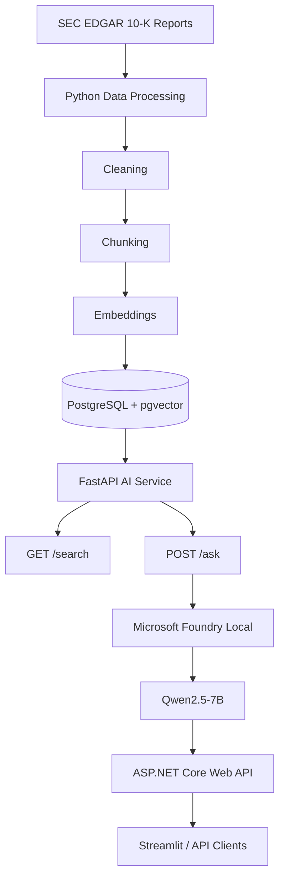

# NASDAQ Financial RAG Assistant

[](https://github.com/hmertelitok/nasdaq-financial-rag/actions)
[](https://www.python.org/)
[](https://dotnet.microsoft.com/)
[](LICENSE)
[](https://github.com/hmertelitok/nasdaq-financial-rag/releases)
[](https://github.com/hmertelitok/nasdaq-financial-rag/stargazers)

Microsoft AI Innovators Summer Internship programı kapsamında geliştirilen **NASDAQ Financial RAG Assistant**, seçili NASDAQ şirketlerinin SEC 10-K raporları üzerinde çalışan Türkçe bir finansal araştırma asistanıdır.

Sistem; kullanıcı sorusuyla ilgili rapor parçalarını PostgreSQL ve pgvector üzerinden getirir, Microsoft Foundry Local üzerinde çalışan yerel dil modeliyle kaynak temelli yanıt üretir ve cevabın dayandığı filing, section, chunk ve benzerlik skorlarını kullanıcıya gösterir.

> **Not:** Bu proje yatırım tavsiyesi üretmez. SEC raporlarının araştırılması, özetlenmesi ve kaynak temelli analiz edilmesi amacıyla geliştirilmiştir.

---

## İçindekiler

- [Proje Tanıtım Videosu](#proje-tanıtım-videosu)
- [Hızlı Başlangıç](#hızlı-başlangıç)
- [Uygulama Görselleri](#uygulama-görselleri)
- [Proje Amacı](#proje-amacı)
- [Desteklenen Şirketler](#desteklenen-şirketler)
- [Veri Kaynağı](#veri-kaynağı)
- [Temel Özellikler](#temel-özellikler)
- [Kullanılan Teknolojiler](#kullanılan-teknolojiler)
- [Sistem Mimarisi](#sistem-mimarisi)
- [Servis Sorumlulukları](#servis-sorumlulukları)
- [RAG Cevap Kalite Sistemi](#rag-cevap-kalite-sistemi)
- [Kalite Değerlendirme Sonucu](#kalite-değerlendirme-sonucu)
- [Örnek Sorular](#örnek-sorular)
- [Proje Durumu](#proje-durumu)
- [Kurulum ve Çalıştırma](#kurulum-ve-çalıştırma)
- [API Dokümantasyonu](#api-dokümantasyonu)
- [Katkıda Bulunma](#katkıda-bulunma)
- [Lisans](#lisans)
- [İletişim](#iletişim)
- [Teşekkürler](#teşekkürler)
- [Yasal Uyarı](#yasal-uyarı)

---

## Proje Tanıtım Videosu

Bu proje, Microsoft AI Innovators Summer Internship programı kapsamında geliştirilmiştir. Aşağıdaki videoda projenin geliştirilme süreci, kullanılan teknolojiler ve öğrenme süreci 3 dakikada özetlenmiştir.

<div align="center">
  <a href="https://youtu.be/mT0T21iGME4" target="_blank">
    
  </a>
  <br>
  <sub><i>Videoyu izlemek için görselin üzerine tıklayın.</i></sub>
</div>

**Video İçeriği:**
- Projenin geliştirilme süreci ve mimari kararlar
- Kullanılan teknolojiler (ASP.NET Core, FastAPI, PostgreSQL + pgvector, Microsoft Foundry Local)
- RAG (Retrieval-Augmented Generation) mimarisi ve uygulama detayları
- Staj sürecinde edinilen teknik kazanımlar

---

## Hızlı Başlangıç

Kullanıcılar için iki farklı kurulum yöntemi sunulmaktadır.

### Yöntem 1: Hazır Dağıtımlar ile Kurulum (Önerilen)

Kurulum ve derleme süreçleriyle uğraşmadan sistemi çalıştırmak için GitHub Releases üzerinden yayınlanan hazır paketleri kullanabilirsiniz.

**1. Paketleri İndirin**

[Releases](https://github.com/hmertelitok/nasdaq-financial-rag/releases) sayfasından en son sürüme ait aşağıdaki arşivleri indirin:
- `Nasdaq-Dotnet-API.zip`
- `Nasdaq-Python-App.zip`

**2. Arşivleri Çıkartın**

Her iki arşivi de ayrı dizinlere çıkartın.

**3. Servisleri Başlatın**

*Öncelikle .NET API servisini başlatın:*
1. `Nasdaq-Dotnet-API` dizinine gidin.
2. `baslat.bat` dosyasını çalıştırın.
3. Konsol penceresinde API'nin başarıyla başlatıldığı onayını bekleyin.

*Ardından Python servislerini başlatın:*
1. `Nasdaq-Python-App` dizinine gidin.
2. `baslat.bat` dosyasını çalıştırın.
3. Sistem; gerekli Python ortamını oluşturacak, bağımlılıkları kuracak ve FastAPI ile Streamlit servislerini başlatacaktır.

**4. Arayüze Erişim**

- **Streamlit Dashboard:** http://localhost:8501
- **FastAPI API Belgeleri:** http://127.0.0.1:8001/docs

**Gereksinimler:**
- Windows 10/11 (WinML desteği için gereklidir)
- Docker Desktop (PostgreSQL servisi için arka planda çalışmalıdır)

**Servisleri Durdurma:**

Tüm açık konsol pencerelerini kapatın ve Python uygulama dizininde aşağıdaki komutu çalıştırın:
```bash
docker-compose down
```

### Yöntem 2: Kaynak Koddan Kurulum (Geliştiriciler İçin)

Projeyi klonladıktan sonra otomatik kurulum betiğini kullanarak geliştirme ortamını hazırlayabilirsiniz:

**Windows:**
```cmd
.\setup-and-run.bat
```

**Mac / Linux:**
```bash
chmod +x setup-and-run.sh
./setup-and-run.sh
```

Betik; Docker volume'ünü oluşturacak, ortam değişkenlerini hazırlayacak, bağımlılıkları kuracak ve tüm servisleri başlatacaktır.

---

## Uygulama Görselleri

### Streamlit Arayüzü

ASP.NET Core, FastAPI, PostgreSQL + pgvector ve Microsoft Foundry Local bileşenlerini tek bir araştırma arayüzünde birleştiren kontrol paneli.


### Kaynak Temelli RAG Cevabı

Kullanıcı soruları, seçilen SEC 10-K rapor parçaları kullanılarak kaynak referanslarıyla yanıtlanır.


### Kaynak Şeffaflığı

Her cevap için şirket, filing tarihi, bölüm, chunk ID, benzerlik skoru, retrieval türü ve embedding modeli görüntülenir.


<details>
<summary>Orijinal SEC 10-K kaynağını görüntüle</summary>

<br>


</details>

---

## Proje Amacı

SEC 10-K raporları uzun, teknik ve manuel olarak incelenmesi zaman alan finansal dokümanlardır.

Bu projenin amacı, genel amaçlı bir chatbot geliştirmek yerine;

- Gerçek SEC dokümanları üzerinde çalışan
- Yanıtlarını kaynak parçalarıyla destekleyen
- Yerel model ve yerel veri altyapısı kullanabilen
- Python ve ASP.NET Core servislerini birlikte kullanan
- Yanıt kalitesini otomatik kontrollerle denetleyen
- Kaynak şeffaflığını kullanıcı arayüzünde gösteren

bir finansal RAG sistemi oluşturmaktır.

---

## Desteklenen Şirketler

| Ticker | Şirket |
|---------|---------|
| AAPL | Apple Inc. |
| MSFT | Microsoft Corporation |
| NVDA | NVIDIA Corporation |
| AMZN | Amazon.com, Inc. |
| GOOGL | Alphabet Inc. |

---

## Veri Kaynağı

Projede SEC EDGAR üzerinden alınan 10-K raporları kullanılmaktadır.

Mevcut veri setinde:

- 5 şirket
- 5 SEC filing
- 334 doküman parçası

bulunmaktadır.

---

## Temel Özellikler

- SEC 10-K raporlarını indirme ve işleme
- Finansal doküman temizleme ve chunking
- Çok dilli embedding üretimi
- PostgreSQL ve pgvector üzerinde vektör saklama
- Semantic Search ile ilgili doküman parçalarını getirme
- Microsoft Foundry Local ile yerel yanıt üretimi
- Türkçe ve kaynak temelli RAG cevapları
- `[Kaynak N]` biçiminde kaynak atıfları
- Filing type, section, chunk ve benzerlik skoru gösterimi
- FastAPI tabanlı dahili AI servisi
- ASP.NET Core Web API
- Tek şirket ve tüm şirketlerde analiz
- Dinamik örnek sorular
- API hata yönetimi
- Yükleme durumu ve analiz ilerleme göstergeleri
- Otomatik RAG cevap kalite değerlendirmesi
- JSON ve CSV kalite raporları
- Modern Streamlit arayüzü

---

## Kullanılan Teknolojiler

### AI ve Veri İşleme

- Python
- Microsoft Foundry Local
- Qwen2.5-7B
- `intfloat/multilingual-e5-small`
- Retrieval-Augmented Generation (RAG)
- Semantic Search
- Embeddings

### Backend

- FastAPI
- ASP.NET Core Web API
- C#

### Veri Katmanı

- PostgreSQL
- pgvector
- SEC EDGAR

### Arayüz

- Streamlit

---

## Sistem Mimarisi



---

## Servis Sorumlulukları

### Python

- SEC veri işleme
- Metin temizleme
- Chunking
- Embedding üretimi
- pgvector semantic search
- Foundry Local entegrasyonu
- RAG cevap üretimi
- Kalite değerlendirmesi

### FastAPI

ASP.NET Core tarafından kullanılan dahili AI servisidir.

| Method | Endpoint | Açıklama |
|---------|----------|----------|
| GET | /health | Sağlık kontrolü |
| GET | /search | Semantic Search |
| POST | /ask | Kaynak temelli RAG cevabı |

### ASP.NET Core Web API

Sistemin dış API katmanıdır.

| Method | Endpoint | Açıklama |
|---------|----------|----------|
| GET | /api/health | API sağlık kontrolü |
| GET | /api/postgres/companies | Şirketler |
| GET | /api/postgres/stats/summary | Veri özeti |
| GET | /api/postgres/filings | Filing kayıtları |
| GET | /api/postgres/chunks | Chunk listesi |
| GET | /api/postgres/search | Semantic Search |
| POST | /api/rag/ask | RAG cevabı |

---

## RAG Cevap Kalite Sistemi

Projede yalnızca HTTP cevabının başarılı olması değil, üretilen cevabın içerik kalitesi de otomatik olarak doğrulanmaktadır.

Kontroller:

- HTTP 200
- Cevap varlığı
- En az üç kaynak
- Beklenen madde sayısı
- Her maddede kaynak atfı
- Atıf aralığı doğrulaması
- `[Kaynak N]` biçimi
- Bozulmuş kaynak gösterimi kontrolü
- Birleşmiş kelime hataları
- Madde uzunluğu
- Yatırım tavsiyesi uyarısı
- Düşük kaliteli ifadeler
- Tekrarlayan maddeler
- Türkçe dil kontrolü
- Makul cevap uzunluğu

---

## Kalite Değerlendirme Sonucu

14 Temmuz 2026 tarihinde gerçekleştirilen otomatik kalite testlerinde sistem tüm şirketlerde başarılı sonuç üretmiştir.

| Ticker | Sonuç | HTTP | Kaynak | Madde | Atıf |
|---------|------|------|---------|-------|------|
| AAPL | PASS | 200 | 5 | 4 | 4 |
| MSFT | PASS | 200 | 5 | 4 | 4 |
| NVDA | PASS | 200 | 5 | 4 | 4 |
| AMZN | PASS | 200 | 5 | 4 | 4 |
| GOOGL | PASS | 200 | 5 | 4 | 4 |

```text
Toplam      : 5
Başarılı    : 5
Başarısız   : 0
Başarı Oranı: %100
```

Raporlar:

```text
reports/rag-quality/rag_quality_evaluation.json
reports/rag-quality/rag_quality_evaluation.csv
```

Çalıştırma:

```powershell
& ".\.venv\Scripts\python.exe" .\src\evaluate_rag_answer_quality.py `
    --output-dir .\reports\rag-quality
```

---

## Örnek Sorular

```text
Microsoft'un bulut bilişim ve yapay zekâ yatırımları şirketin büyüme stratejisini nasıl destekliyor?
```

```text
NVIDIA'nın tedarik zinciri, ihracat kontrolleri ve yapay zekâ talebiyle ilgili riskleri nelerdir?
```

```text
Apple'ın temel iş riskleri nelerdir?
```

```text
Amazon'un AWS, lojistik, operasyonel maliyetler ve düzenleyici riskleri nelerdir?
```

---

## Proje Durumu

Tamamlanan bileşenler:

- SEC veri işleme hattı
- Metin temizleme
- Chunking
- Embedding
- PostgreSQL
- pgvector
- Semantic Search
- FastAPI
- Microsoft Foundry Local
- ASP.NET Core Web API
- Kaynak temelli RAG
- Kalite değerlendirme sistemi
- JSON/CSV raporları
- Streamlit arayüzü
- Uçtan uca testler
- Kurulum dokümantasyonu
- Otomatik CI/CD ve dağıtım altyapısı

---

## Kurulum ve Çalıştırma

> **Docker Notu:** `docker-compose.yml` yalnızca PostgreSQL + pgvector servisini container içerisinde çalıştırır. Microsoft Foundry Local, Windows/WinML donanım hızlandırmasına ihtiyaç duyduğu için FastAPI, ASP.NET Core ve Streamlit host makine üzerinde çalıştırılır.

Ayrıntılı kurulum:

```text
docs/setup_and_run.md
```

Servis sırası:

```text
PostgreSQL + pgvector
          |
          v
FastAPI
          |
          v
ASP.NET Core
          |
          v
Streamlit
```

---

## API Dokümantasyonu

```text
docs/postgres_pgvector_api.md
```

---

## Katkıda Bulunma

Katkılarınızı memnuniyetle karşılarız. Lütfen aşağıdaki adımları izleyin:

1. Projeyi fork edin
2. Yeni bir branch oluşturun (`git checkout -b feature/amazing-feature`)
3. Değişikliklerinizi commit edin (`git commit -m 'feat: add amazing feature'`)
4. Branch'inizi push edin (`git push origin feature/amazing-feature`)
5. Pull Request açın

---

## Lisans

Bu proje MIT lisansı altında lisanslanmıştır. Detaylar için [LICENSE](LICENSE) dosyasına bakın.

---

## İletişim

**Halis Mert Elitok**
- GitHub: [@hmertelitok](https://github.com/hmertelitok)
- LinkedIn: [linkedin.com/in/hmertelitok](https://linkedin.com/in/hmertelitok)
- Email: [email adresiniz]

---

## Teşekkürler

- **Microsoft AI Innovators** - Staj programı ve mentorluk desteği
- **SEC EDGAR** - Açık veri kaynağı
- **pgvector** - PostgreSQL için vektör arama desteği
- **Microsoft Foundry Local** - Yerel model inference altyapısı

---

## Yasal Uyarı

Bu proje yatırım tavsiyesi vermez.

Üretilen cevaplar yalnızca SEC 10-K raporları üzerinden araştırma, özetleme ve doküman temelli bilgi sunmak amacıyla hazırlanmıştır. Finansal kararlar için tek başına kullanılmamalıdır.
